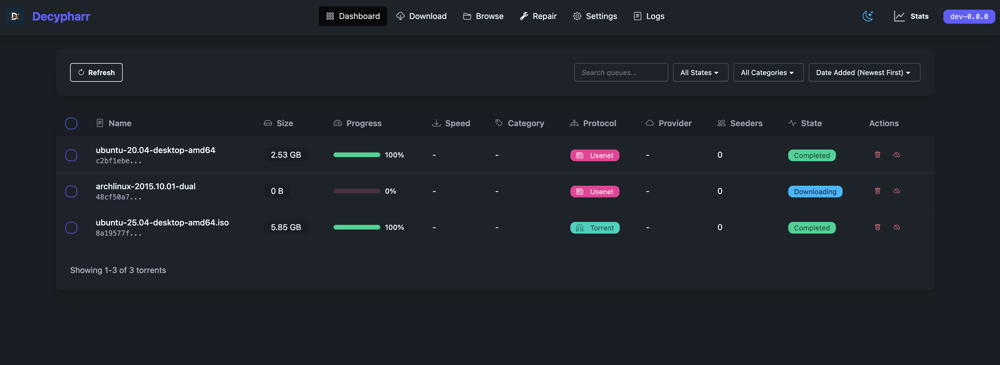

# Decypharr



**Decypharr** is a **Media Gateway** for Debrid services and Usenet, written in Go.

## What is Decypharr?

Decypharr provides a unified interface for Sonarr, Radarr, and other *Arr applications to access Debrid providers and Usenet indexers. It focuses on performance and standard protocol compatibility.

## Features

- Mock Qbittorent API that supports the Arrs (Sonarr, Radarr, Lidarr etc)
- Full-fledged UI for managing torrents
- Multiple Debrid providers support
- WebDAV server support for each debrid provider
- Optional mounting of WebDAV to your system(using [Rclone](https://rclone.org/))
- Repair Worker for missing files

## Supported Debrid Providers

- [Real Debrid](https://real-debrid.com)
- [Torbox](https://torbox.app)
- [Debrid Link](https://debrid-link.com)
- [All Debrid](https://alldebrid.com)

## Quick Start

### Docker (Recommended)

```yaml
services:
  decypharr:
    image: cy01/blackhole:latest
    container_name: decypharr
    ports:
      - "8282:8282"
    volumes:
      - /mnt/:/mnt:rshared
      - ./configs/:/app # config.json must be in this directory
    restart: unless-stopped
    devices:
      - /dev/fuse:/dev/fuse:rwm
    cap_add:
      - SYS_ADMIN
    security_opt:
      - apparmor:unconfined
```

## Documentation

For complete documentation, please visit our [Documentation](https://sirrobot01.github.io/decypharr/).

The documentation includes:

- Detailed installation instructions
- Configuration guide
- Usage with Sonarr/Radarr
- WebDAV setup
- Repair Worker information
- ...and more!

## Basic Configuration

You can configure Decypharr through the Web UI or by editing the `config.json` file directly.

## Contributing

Contributions are welcome! Please feel free to submit a Pull Request.

## License
This project is licensed under the MIT License. See the [LICENSE](LICENSE) file for details.